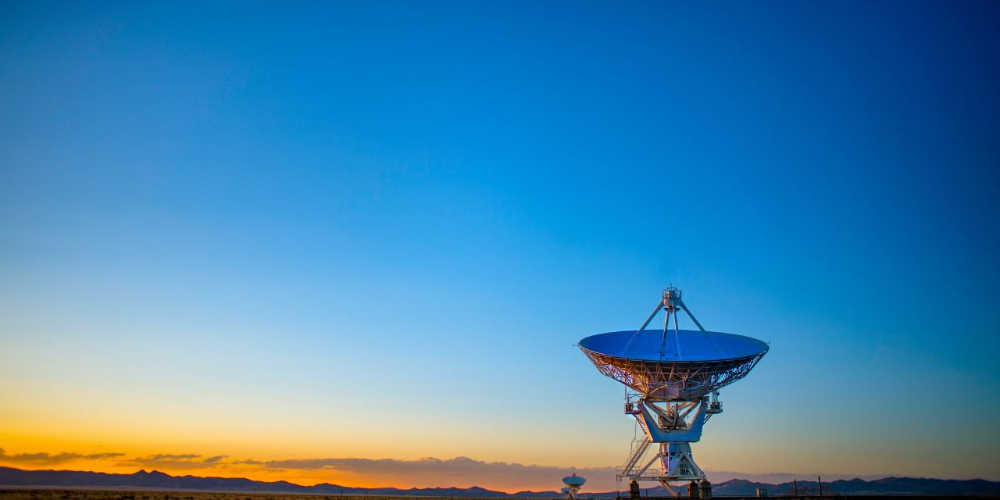

<i>Photo by [Donald Giannatti](https://unsplash.com/@wizwow) on [Unsplash](https://unsplash.com/photos/Wj1D-qiOseE)</i>

# 👋 Hi, I'm Menhaz

An enthusiast who loves building things and learning along the way.

## 🌱 Current Focus
Building cool stuff with **React**, **Node.js**, and **Kotlin**

## 🛠️ Skills

## 📫 Connect

✨ Thanks for stopping by! ✨
